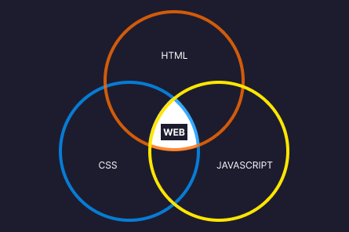

:::caution
Sebelum memulai belajar Javascript, saya harap kamu sudah mempelajari HTML dan CSS, setidaknya bagian dasarnya. Jika belum, silakan pelajari itu dulu karena di tutorial Bahas Javascript ini saya akan menggunakan html dan css untuk dukungan pembelajaran tanpa penjelasan.
:::

import Link from "@docusaurus/Link";

## Apa itu Javascript&#63;

Javascript merupakan bahasa scripting yang banyak digunakan dalam pengembangan aplikasi web. Meskipun begitu, sekarang sudah banyak library atau framework yang memanfaatkan bahasa Javascript untuk pengembangan aplikasi mobile dan desktop. Mempelajari Javascript merupakan modal awal yang bagus untuk memulai karir dibidang Software Engineer khususnya pemrograman web.

:::note
Secara teori, Javascript merupakan bahasa pemrograman yang multi-paradigm, high level object oriented. Bagaimana itu? Klik <Link to="/blog/penjelasan%20javascript%20secara%20teori">**disini**</Link> untuk membaca penjelasan lengkapnya.
:::

## Role Javascript di Aplikasi Web

Perhatikan ilustrasi berikut:

Jika HTML adalah struktur website, css adalah desain tampilan website, maka Javascript adalah yang membuat websitenya menjadi lebih menarik dan interaktif.

Tapi sebelum membahas Javascript terlalu jauh, mari kita belajar dasar pemrograman Javascript terlebih dahulu, supaya kita memiliki pondasi yang kuat dimasa depan.

:::note
Untuk proses pembelajaran yang mudah, saya akan mengajak kamu untuk fokus belajar javascript dibidang pemrograman web.
:::

## Syarat memulai belajar Javascript

1. Laptop
2. Browser(Chrome atau Mozilla Firefox)
3. Code editor(Visual Studio Code)

Jika ketiga syarat sudah kamu miliki, maka sekarang kamu bisa memulai untuk belajar Javascript, dimulai dari mempersiapkan environment belajar yang bisa kamu pelajari di bab selanjutnya.
