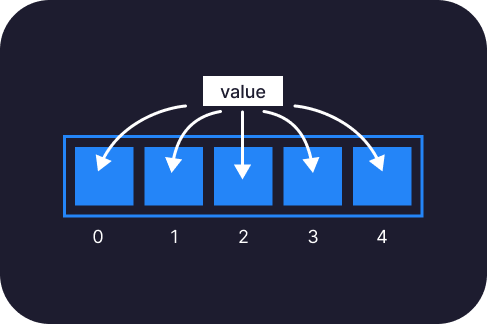

# Array

## Apa itu array&#63;

Array merupakan pengelompokan data-data yang sama menjadi satu kelompok.
Dalam pemrograman Javascript, array bisa menyimpan tipe data apapun. Array bisa kita simpan kedalam variable seperti halnya value biasa.
Contoh:

```javascript
const bilanganBulat = [1, 2, 3, 4, 5, 6, 7];
const hobi = ["olahraga", "membaca buku", "menulis"];
const angka = ["satu", 2, "tiga", true, null, undefined, Object];
```

:::caution Himbauan!
Meskipun sebuah array dapat menyimpan value dengan tipe data yang berbeda, akan tetapi saya tetap menganjurkan teman-teman untuk memperhatikan apakah satu data dengan data lain saling berkorelasi atau tidak. Contoh array yang baik adalah seperti variable `bilanganBulat` dan `hobi` diatas.
:::

Didalam pemrograman, kita akan sering menggunakan data. Entah data itu kita sendiri yang bikin, atau datang dari manapun, yang kemudian data itu akan kita olah agar bisa digunakan di aplikasi kita. Untuk dapat mengolah data, kita perlu mempelajari struktur data, salah satunya array.

## Mengapa menggunakan array&#63;

```javascript
const hobi1 = "olahraga";
const hobi2 = "membaca buku";
const hobi3 = "menulis";
```

Sangatlah tidak efisien ketika kita perlu menyimpan beberapa value berbeda dengan kategori yang sama, kedalam variable yang berbeda.
:::info Bayangkan!
Kamu memiliki 10 hobi, atau 20? kamu harus membuat 20 variable! Hal ini hanya membuat program lambat dan kodingan kita menjadi ruwet atau susah dimantain kedepannya.
:::
Solusinya adalah menggunakan array. Jadi, alih-alih seperti itu, akan lebih baik jika kita menyimpan hobi kedalam satu variable:

```javascript
const hobi = ["olahraga", "membaca buku", "menulis"];
```

## Komponen array

Array terdiri dari index, dan value(nilai). Index merupakan urutan setiap nilai yang ada didalam barisan array. Di bahasa Javascript, urutan value didalam array dihitung dari 0(nol).

:::info Misalkan!
Kita memiliki 5(lima) buah value didalam array, maka value pertama merupakan urutan 0(nol) dan value terakhir merupakan di urutan 4(empat).
:::



```javascript
const hobi = ["olahraga", "membaca buku", "menulis"];
```

## Array didalam array

Kamu juga bisa menyimpan array sebagai value didalam array.

```javascript
const hobi = [["futsal, badminton, voli, basket"], ["membaca buku", "menulis"]];
```

## Cara menggunakan array

Array biasa digunakan dengan cara memanfaatkan index-nya.

```javascript
const hobi = ["olahraga", "membaca buku", "menulis"];

const hobiUrutanSatu = hobi[0];

console.log(hobiUrutanSatu); //output: "olahraga"
```

### Selesai!

Itulah yang perlu kamu ketahui tentang array di Javascript. Pastikan kamu **memahaminya dengan baik** karena array merupakan salah satu hal terpenting dalam pemrograman(tidak hanya Javascript).
