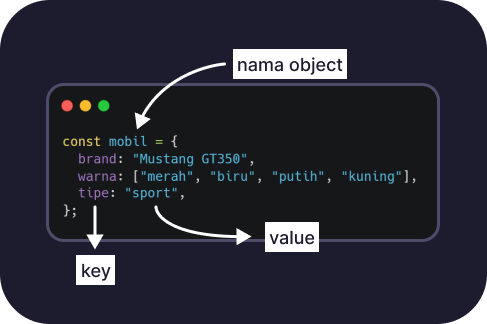

# Object

Selain array, Object merupakan tipe data yang terpenting di bahasa Javascript. Object dapat mewakili sebuah obyek nyata, misalkan mobil.

## Struktur Object

Object terdiri dari pasangan _key-value_ yang saling berhubungan.

| Komponen | Deskripsi                                                                                                       |
| -------- | --------------------------------------------------------------------------------------------------------------- |
| key      | Seperti variable yang digunakan sebagai penentu sebuah data(contoh warna, harga)                                |
| value    | Sama seperti value dari variable, value object juga merupakan satu atau lebih data yang disimpan kedalam `key`. |

## Cara membuat Object

Untuk membuat object, kita dapat menyimpannya kedalam sebuah variable(sama seperti array), gunakan kurung kurawal yang didalamnya kita isi dengan pasangan _key-value_. Berikut contohnya:

```javascript
const mobil = {
  brand: "Mustang GT350",
  warna: ["merah", "biru", "putih", "kuning"],
  tipe: "sport",
  roda: {
    brand: "Firestone",
    ukuran: ["P235/55WR17", "P235/50WR18", "P255/40WR19", "P295/35ZR19"],
  },
};
```



## Cara menggunakan object yang benar

Untuk dapat menggunakan atau mengakses data yang tersimpan didalam sebuah object, kita dapat menggunakan konsep _dot notation_ dimana kita mengakses elemen didalam object menggunakan simbol titik(.). Misalkan dari object `mobil` berikut, kita dapat mengakses nama brand, warna, dan tipe dari mobil tersebut sebagai berikut:

### 1. mengakses properti sederhana

```javascript
//object mobil
const mobil = {
  brand: "Mustang GT350",
  warna: ["merah", "biru", "putih", "kuning"],
  tipe: "sport",
  roda: {
    brand: "Firestone",
    ukuran: ["P235/55WR17", "P235/50WR18", "P255/40WR19", "P295/35ZR19"],
  },
};

//cara akses
mobil.brand; //Output: "Mustang GT350"
mobil.warna; //Output: "["merah", "biru", "putih", "kuning"]"
mobil.tipe; //Output: "sport"
```

### 2. Mengakses array didalam object

Hasil dari `mobil.warna` adalah sebuah array, jika kamu ingin mengunakan array tersebut, maka kamu perlu menggunakan index-nya juga. Contoh:

```javascript
mobil.warna[0]; //Output: "merah"
mobil.warna[1]; //Output: "biru"
mobil.warna[2]; //Output: "putih"
mobil.warna[3]; //Output: "kuning"
```

### 3. Mengakses object didalam object

Jika ingin mengakses Object didalam object lain(_nesting_), cara mengaksesnya tetap sama, yaitu menggunakan sambungan _dot-notation_ juga.

```javascript
mobil.roda; //Output: roda: { ... }
mobil.roda.brand; //Output: "Firestone"
mobil.roda.ukuran; //Output: ["P235/55WR17", "P235/50WR18", "P255/40WR19", "P295/35ZR19"]
```

:::

## Selesai!

Itulah yang perlu kamu ketahui tentang dasar object di Javascript. Pastikan kamu **memahaminya dengan baik** karena object merupakan salah satu hal terpenting dalam pemrograman(tidak hanya Javascript).
